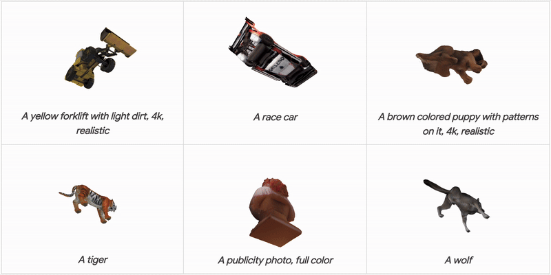

# MD-ProjTex

[Paper](https://arxiv.org/abs/2504.02762) | [Project Website](http://mdprojtex.abyildirim.com/)

A training-free framework for text-guided 3D texture generation using multi-diffusion in UV space.

Code coming soon...
